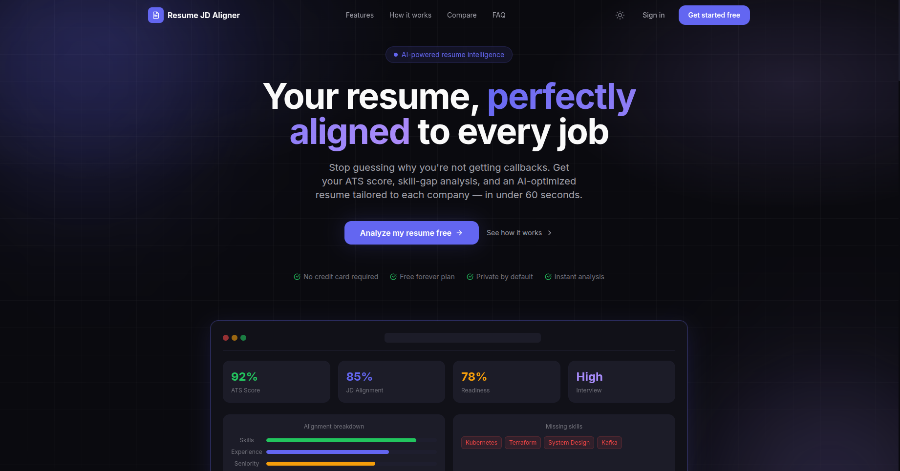
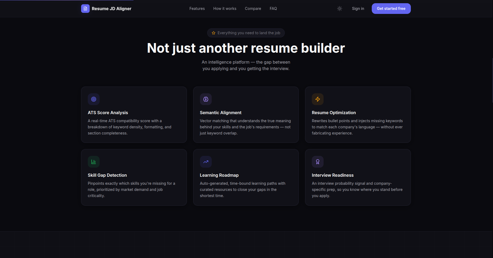
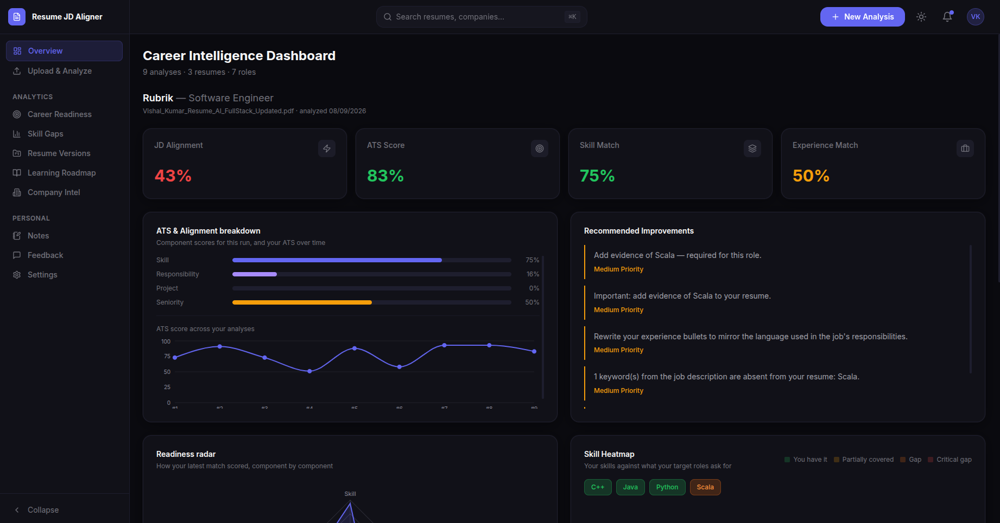
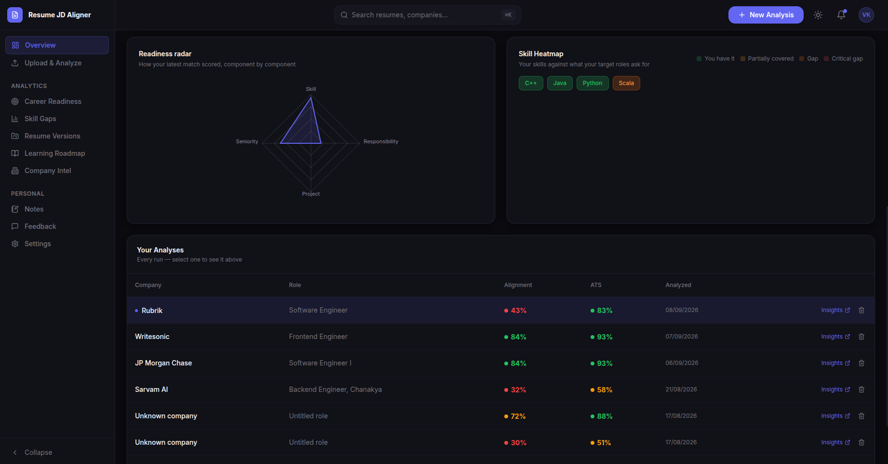
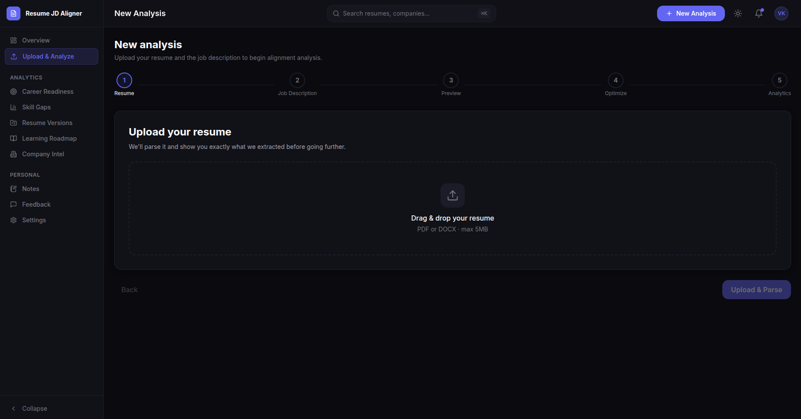
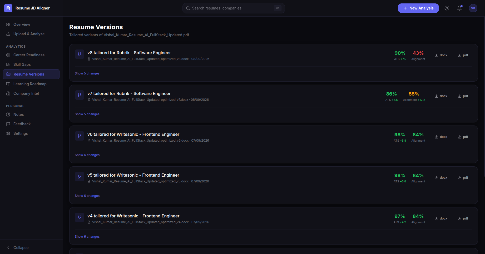
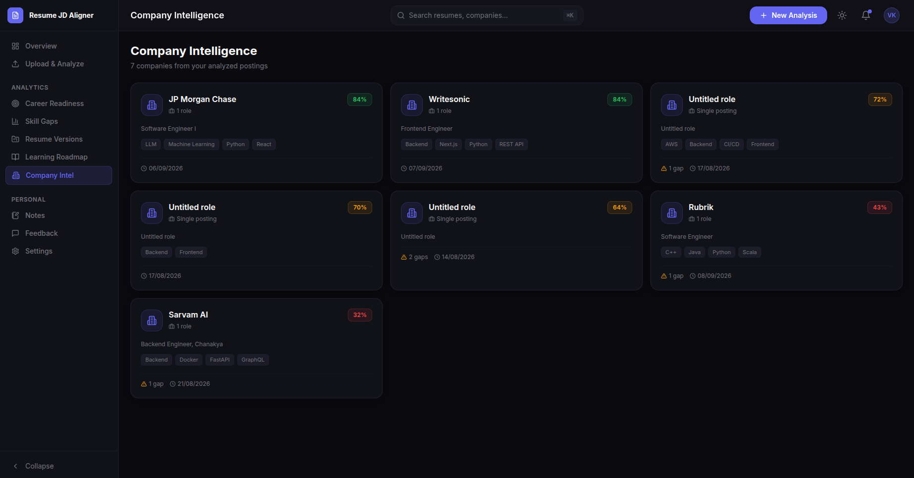

<div align="center">

# Resume JD Aligner

### Your resume, perfectly aligned to every job.

Stop guessing why you're not getting callbacks. Get your **ATS score**, **skill‑gap analysis**, and an
**AI‑optimized resume** tailored to each company — in under a minute, without inventing anything your
resume doesn't already support.

**🌐 Live:** [Website](https://resume-jd-aligner-omega.vercel.app/) <!-- replace # with your real URLs -->

📚 [Documentation](docs/README.md) · 🚀 [Getting started](docs/getting-started.md) · 🐛 [Report an issue](https://github.com/VishalKumar369/resume-jd-aligner/issues)



</div>

---

## Table of contents

- [What is Resume JD Aligner?](#what-is-resume-jd-aligner)
- [Features](#features)
- [Screenshots](#screenshots)
- [How it works (user guide)](#how-it-works-user-guide)
- [Tech stack](#tech-stack)
- [Architecture](#architecture)
- [Getting started (local)](#getting-started-local)
- [Environment variables](#environment-variables)
- [Deployment](#deployment)
- [Project structure](#project-structure)
- [Testing](#testing)
- [Design principles](#design-principles)

---

## What is Resume JD Aligner?

Resume JD Aligner is a web app that tells you **how well your resume matches a specific job** and then
helps you **fix the gap**. You upload your resume and a job description; it scores the match, shows you
which skills are covered, partially covered, or missing, and generates a tailored resume version you can
download as **DOCX or PDF** — with before/after scores so you can see the improvement.

It's built for job seekers who want an honest, data-backed answer to *"is my resume good enough for this
role, and what exactly should I change?"*

**Who it's for:** anyone applying to jobs who wants ATS-friendly, role-specific resumes without paying for
a black-box "AI resume builder" that makes things up.

---

## Features

<div align="center">



</div>

| | Feature | What it does |
|---|---|---|
| 🎯 | **ATS Score Analysis** | A real-time ATS compatibility score with a breakdown of keyword coverage, structural safety, impact metrics, and section health. |
| 🧠 | **Alignment Scoring** | A weighted match across skills, responsibilities, projects, and seniority — with a per-component breakdown, not just keyword overlap. |
| ⚡ | **Resume Optimization** | Rewrites bullet points and highlights missing keywords to match each company's language — **without ever fabricating experience**. |
| 📊 | **Skill Gap Detection** | Pinpoints exactly which skills you're missing for a role, prioritized by importance and job criticality. |
| 📈 | **Learning Roadmap** | Auto-generated, time-bound learning paths with curated resources to close your gaps in the shortest time. |
| 🏅 | **Interview Readiness** | An interview-probability signal and company-specific prep so you know where you stand before you apply. |

Plus: **resume version history** (every tailored variant with before/after scores), **company intelligence**
(insights across every posting you've analyzed), **notes**, and **feedback**.

---

## Screenshots

<table>
  <tr>
    <td width="50%"><b>Career Intelligence Dashboard</b><br/></td>
    <td width="50%"><b>Readiness radar, heatmap & analyses</b><br/></td>
  </tr>
  <tr>
    <td width="50%"><b>Upload & Analyze (5-step flow)</b><br/></td>
    <td width="50%"><b>Resume Versions</b><br/></td>
  </tr>
  <tr>
    <td colspan="2"><b>Company Intelligence</b><br/></td>
  </tr>
</table>

> 📸 Screenshots live in [`docs/screenshots/`](docs/screenshots/). See that folder's README for the exact
> filenames to use so they render here.

---

## How it works (user guide)

Sign up, then run an analysis from **Upload & Analyze**. It's a guided 5-step flow:

1. **Resume** — Drag & drop a PDF or DOCX (max 5 MB). The app parses it and shows you exactly what it
   extracted, so a bad parse is caught before it affects your score.
2. **Job Description** — Paste the JD text or a link. The app pulls out the company, role, seniority,
   required skills, and nice-to-haves.
3. **Preview** — Review the parsed resume and JD side by side, pick a resume template/layout, and reorder
   or hide sections before optimizing.
4. **Optimize** — The app promotes evidenced skills, reorders content by relevance, rewrites bullets, and
   highlights JD keywords. Download the result as **DOCX or PDF**; it's saved as a version with before/after
   ATS and alignment scores.
5. **Analytics** — See the full breakdown on your dashboard.

Everything you create is available from the sidebar:

| Section | What you'll find |
|---|---|
| **Overview** | Per-analysis dashboard: JD Alignment, ATS, Skill Match, Experience Match, a component breakdown, an ATS trend, a readiness radar, a skill heatmap, and recommended improvements. Pick any past run to view it. |
| **Upload & Analyze** | Start a new analysis. |
| **Career Readiness** | Your overall readiness across target roles. |
| **Skill Gaps** | Gaps aggregated across everything you've analyzed. |
| **Resume Versions** | Every tailored resume with its score deltas and DOCX/PDF downloads. |
| **Learning Roadmap** | A prioritized plan to close your gaps. |
| **Company Intel** | One card per company you've analyzed, with roles, key skills, and gaps. |
| **Notes / Feedback / Settings** | Personal notes, product feedback, and account settings. |

> 🔒 **Your data is private by default** — every endpoint is scoped to the signed-in user.

---

## Tech stack

**Frontend**
- Next.js 14 (App Router, React 18) · Tailwind CSS (light/dark theming)
- Framer Motion (animation) · Recharts (charts) · Zustand (state) · react-hot-toast
- JWT bearer-token auth against the API

**Backend**
- FastAPI (async) · SQLAlchemy 2.0 async + asyncpg · Alembic migrations · Pydantic v2
- JWT auth (`python-jose`), password hashing (`passlib`/`bcrypt`)
- Optional email-OTP verification at signup (flag-gated: SMTP or dev console)

**Data & storage**
- PostgreSQL (**Neon** in production, local Postgres in dev)
- Uploaded/generated files via a **pluggable storage adapter** — `local` / `supabase` / `cloudinary` /
  `firebase`, selected by `STORAGE_TYPE` (**Supabase** in production)

**Parsing, documents & AI**
- pdfplumber + pypdf and python-docx for extraction
- python-docx + ReportLab for DOCX/PDF generation (LibreOffice for docx→pdf when available)
- AI (optional): Gemini / OpenAI / Groq — off by default except bullet rewriting

---

## Architecture

```text
                    GitHub
                      │
             ┌────────┴────────┐
             ↓                 ↓
          Next.js            FastAPI
          Vercel             Render
                                │
                     ┌──────────┴──────────┐
                     ↓                     ↓
                   Neon                Supabase
                PostgreSQL              Storage
```

- **GitHub** — a push to the deploy branch triggers both platforms.
- **Vercel** builds and serves the Next.js frontend, which calls the API over HTTPS.
- **Render** runs the FastAPI service (`uvicorn app.main:app`) and applies Alembic migrations to Neon.
- **Neon** is the managed Postgres database; **Supabase** stores uploaded and generated files.

More detail in [docs/deployment-architecture.md](docs/deployment-architecture.md) and [docs/architecture.md](docs/architecture.md).

---

## Getting started (local)

**Prerequisites:** Python 3.12, Node.js 18+, PostgreSQL 14+.

```bash
# 1. Database
createdb resume_jd_aligner

# 2. Backend
python3 -m venv .venv
.venv/bin/pip install -r backend/requirements.txt
cp backend/.env.example backend/.env        # set SQLALCHEMY_DATABASE_URI and SECRET_KEY
cd backend && ../.venv/bin/python -m alembic upgrade head
../.venv/bin/python -m uvicorn app.main:app --port 8000 --reload

# 3. Frontend (new terminal)
cd frontend && npm install
# set NEXT_PUBLIC_API_URL in frontend/.env.local  (e.g. http://localhost:8000)
npm run dev
```

Open **http://localhost:3000** and sign up. Works with **no AI key** at all — adding one only enables
bullet rewriting (see [backend/docs/llm-budget.md](backend/docs/llm-budget.md), since free tiers are metered
per day). Full setup and troubleshooting: [docs/getting-started.md](docs/getting-started.md).

---

## Environment variables

| Where | Variable | Purpose |
|---|---|---|
| Backend | `SQLALCHEMY_DATABASE_URI` | Postgres/Neon connection string |
| Backend | `SECRET_KEY` | JWT signing secret |
| Backend | `STORAGE_TYPE` | `local` / `supabase` / `cloudinary` / `firebase` |
| Backend | `SUPABASE_URL`, `SUPABASE_SERVICE_KEY`, `SUPABASE_BUCKET_NAME` | Supabase Storage (when `STORAGE_TYPE=supabase`) |
| Backend | `EMAIL_VERIFICATION_ENABLED` | Turn signup OTP on/off |
| Backend | `AI_PROVIDER`, `GEMINI_API_KEY` / `OPENAI_API_KEY` / `GROQ_API_KEY` | Optional AI for bullet rewriting |
| Frontend | `NEXT_PUBLIC_API_URL` | Base URL of the FastAPI API |
| Frontend | `NEXT_PUBLIC_EMAIL_VERIFICATION_ENABLED` | Show/hide the OTP step (keep in step with the backend flag) |

---

## Deployment

| Component | Platform | Notes |
|---|---|---|
| Frontend | **Vercel** | Root directory `frontend/`; set `NEXT_PUBLIC_API_URL` to the Render API URL. |
| Backend | **Render** | Root directory `backend/`; build `pip install -r requirements.txt`, start `uvicorn app.main:app --host 0.0.0.0 --port $PORT`. Python pinned to 3.12 via `backend/.python-version`. |
| Database | **Neon** | Set `SQLALCHEMY_DATABASE_URI`; run `alembic upgrade head`. |
| Storage | **Supabase** | Create a private bucket; set `STORAGE_TYPE=supabase` + the `SUPABASE_*` vars. |

---

## Project structure

```text
resume-jd-aligner/
├── backend/
│   ├── app/
│   │   ├── api/v1/          route handlers
│   │   ├── core/            config, security
│   │   ├── db/              session, declarative base
│   │   ├── models/          SQLAlchemy models
│   │   ├── repositories/    query layer
│   │   ├── schemas/         Pydantic contracts
│   │   └── services/        extraction, parsing, alignment, ats, optimization,
│   │                        documents, analytics, storage, email, ai
│   ├── alembic/versions/    migrations
│   └── tests/               backend test suite
├── frontend/
│   ├── app/                 pages (App Router)
│   ├── components/          UI and feature components
│   └── hooks/ services/     data fetching and API client
└── docs/                    documentation, design intent, screenshots
```

---

## Testing

```bash
# Backend
cd backend && ../.venv/bin/python -m pytest tests -q

# Frontend
cd frontend && npx vitest run && npm run build
```

---

## Design principles

- **Nothing is invented.** Every rewritten bullet is diffed against its original and discarded if it adds a
  figure, technology, or name that wasn't there. Skills surface only when already evidenced.
- **A broken parse is never scored as a weak candidate.** Every analysis carries extraction health, so a
  0% match is distinguishable from a file that couldn't be read.
- **Deterministic by default.** Extraction and scoring use no AI and are fully reproducible; a model is
  optional and, by default, used only for rewriting prose.
- **Uncertainty is stated.** Heuristic signals (e.g. interview readiness) are labeled as heuristics, not
  model-trained predictions.

See [docs/README.md](docs/README.md) for what's built versus originally designed.
